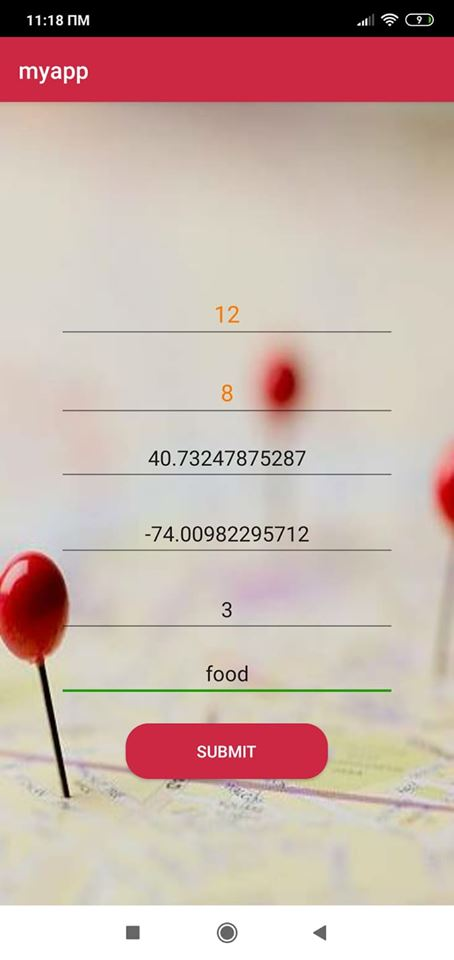
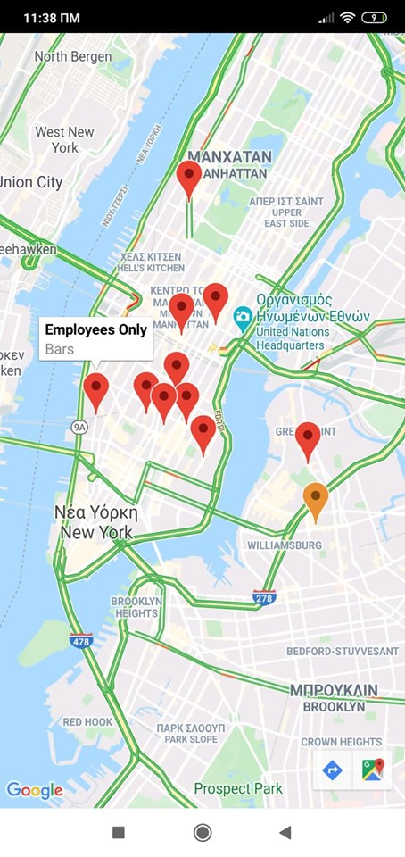

# Recommendation System Project
based on "Collaborative Filtering for Implicit Feedback Datasets"

It is the implementation / application of our project in "Distributed Systems" Course \
Department: Computer Science,Athens University of Economics and Business ([aueb.gr/cs](https://www.dept.aueb.gr/en/cs)) \

The project is coded in **Java** and using xxx libraries.

The directory structure of the project is shown below.

## Team Members

* Chatzilygeroudi Georgia
* Messanakis Kostis
* Sourtzis Alexis
* Vlataki Spyridoula

## Project Informations

We approach the project using "Collaborative Filtering", a popular technique that makes predictions for a user's taste on a 'target'-attribute by collecting preferences information from many users on the same attribute. \
[Collaborative Filtering](https://en.wikipedia.org/wiki/Collaborative_filtering) 

The project basically consists of two parts: 
* Java Application Part 
* Andoid Part 
  
The first part implements the entire functionality of the Recommendation System by using a 'Client-Server' architecture.On the Server side, a Distributed System approach is used to reduce the computational workload. 

The second part implements an Android application that helps the user interact with the server as a client and receive recommendations based on what other users with similar 'taste' recommended. 

## Run Instructions
 1. Create a Java Maven Project in Intellij or in any other IDE(with the files in JavaApplication folder).
 2. Run Server('filename' file)
 3. Create a project in Android studio(with the files in Android folder )
 4. Fill in your credentials(screen should be like Figure1) and press 'button to press'
 5. A Google Maps screen should open with your 'top-recommendations (Figure2) 

### Figures
*   
* 
